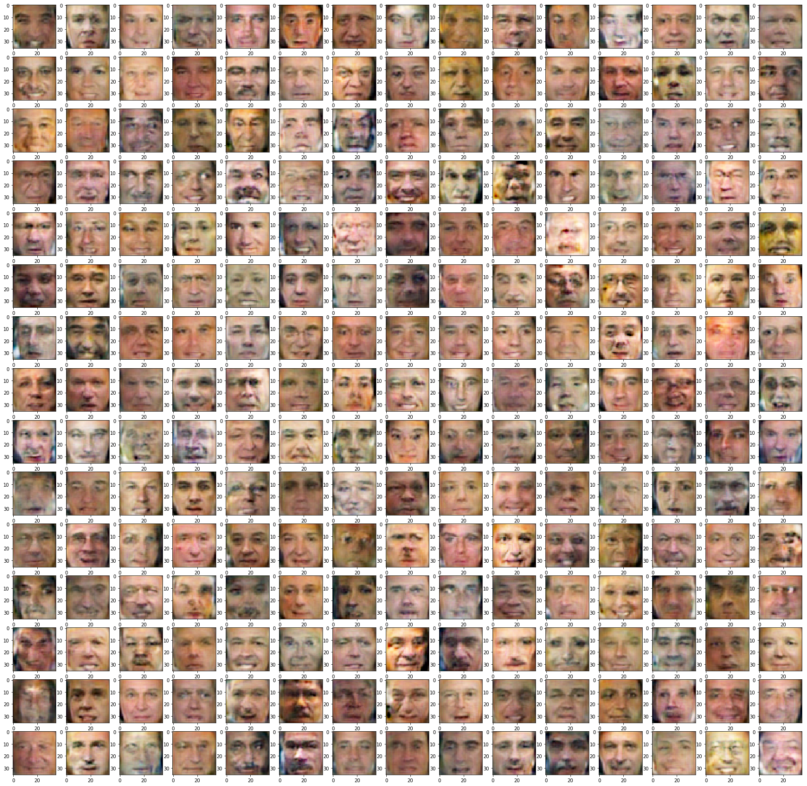
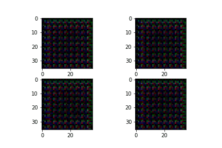

# Generating human faces with Adversarial Networks 

## Idea

We need to define two models:
* **G**enerator - takes random noize for inspiration and tries to generate a face sample. 
  * Let's call it __G__(z), where z is a gaussian noize.
* **D**iscriminator - takes a face sample and tries to tell if it's great or fake. 
  * Predicts the probability of input image being a __real face__
  * Let's call it __D__(x), x being an image.
  * __D(x)__ is a predition for real image and __D(G(z))__ is prediction for the face made by generator.

We train the two networks concurrently:
* Train __discriminator__ to better distinguish real data from __current__ generator
* Train __generator__ to make discriminator think generator is real
* Since discriminator is a differentiable neural network, we train both with gradient descent.

Training is done iteratively until discriminator is no longer able to find the difference (or until you run out of patience).

Some best practices: https://github.com/soumith/ganhacks

## Results

## Animation

## CLI
Use `cli.py` to generate fake faces from pretrained model

## TensorFlow 1
Notebook `tf-[deprecated].ipynb` has the old tensorflow v1 incompatible implementation of fake the face generator with a different loss function.